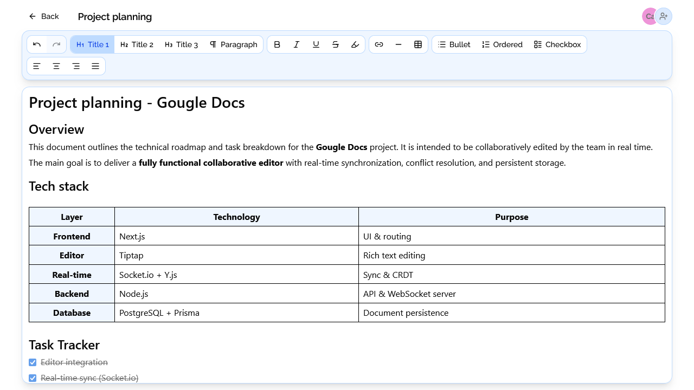

# Gougle Docs 📄

Gougle Docs is a real-time collaborative text editor inspired by modern online writing tools. This project focuses on seamless collaboration, performance, and the exploration of advanced frontend and backend technologies.

## 🚀 Demo

See it [on Yohannimation](https://gougle-docs.yohannimation.fr)

## 🧰 Tech Stack

### Frontend

- ⚙️ **Next.js** (SSR)
- 🟦 **TypeScript**
- ✍️ **Tiptap** (rich text editor)
- 🔄 **Y.js** (CRDT)
- 🔗 **Socket.io** (real-time communication)
- 🧩 **Shadcn UI** + **TailwindCSS** (user interface)

### Backend

- ⚙️ **Node.js**
- 🟦 **TypeScript**
- 🛣️ **Express**
- 🔗 **Socket.io**

### Database

- 🐘 **PostgreSQL**
    - Document storage in JSON (adapted for Tiptap)

## 🎯 Project Goal

This project was created as part of a learning process. After discovering Socket.io through a small class project, the goal was to go further by building a complete application.

- Step out of my comfort zone
- Explore new tools (Y.js, Tiptap, SSR with Next.js)
- Understand the challenges of real-time collaboration

## ✨ Features

- ✍️ Rich text editing :
    - Headings
    - Paragraphs
    - Bold, italic, underline, strikethrough
    - Highlighting
    - Links
    - Dividers
- 📋 Advanced formatting :
    - Bullet lists
    - Numbered lists
    - Checkboxes
    - Tables
    - Text alignment
    - Markdown support
- 🤝 Real-time collaboration :
    - Instant synchronization between users
    - Automatic assignment of a random animal + color to identify each connected user
- 💾 Document management :
    - Create, read, update, and delete (CRUD)
    - Auto-save with a backend debounce system to avoid overloading the database

## 🧭 Planned Features

- 🔐 Authentication system (login / signup)
- 📁 Folder management / document organization
- 📤 Document export (PDF, Markdown…)

## 🐳 Docker

| Action                        | Command                                                      |
|-------------------------------|--------------------------------------------------------------|
| Build and start container     | `docker compose up --build`                                  |
| Start containers              | `docker compose up`                                          |
| Stop containers               | `docker compose down`                                        |
| Access **frontend** container | `docker compose exec gougle-docs-frontend sh`                |
| Access **backend** container  | `docker compose exec gougle-docs-backend sh`                 |
| Prisma migration              | `docker compose exec gougle-docs-backend npx prisma bd push` |

## 🙋‍♂️ Author

Created by **Yohann RENAULD**

[Github](https://github.com/yohannimation) - [Portfolio yohannimation](https://yohannimation.fr)
